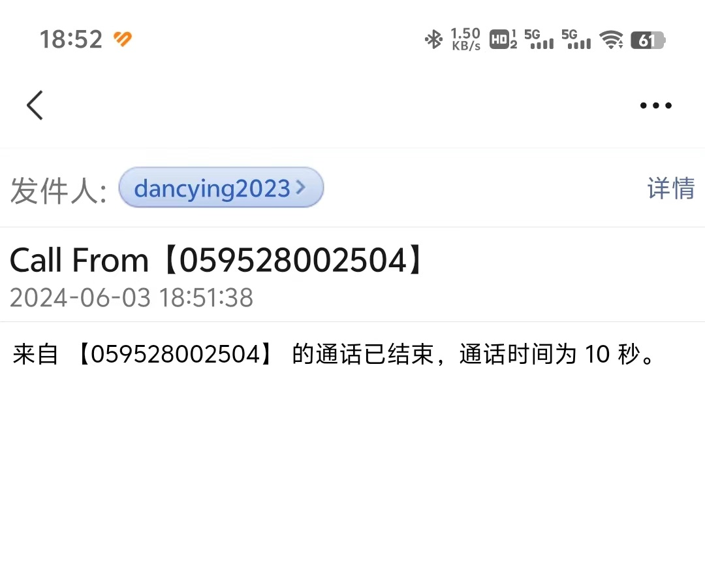
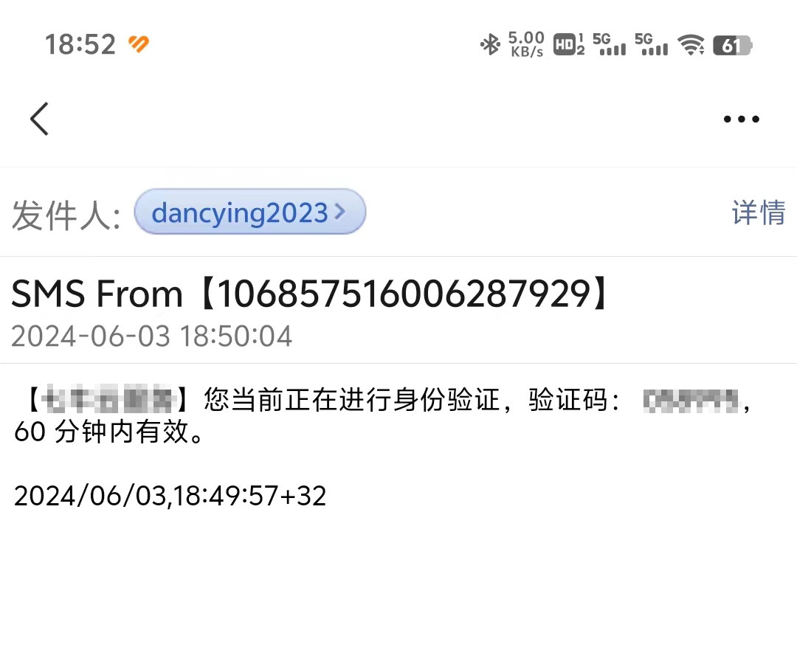
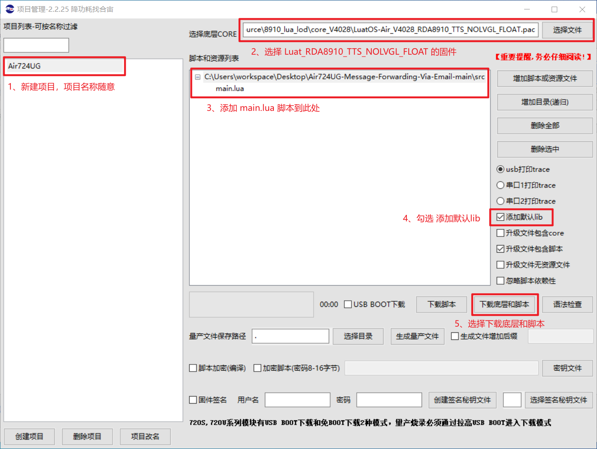

# Air724UG-Message-Forwarding-Via-Email

本项目实现了在 Air724UG 模块上，以邮件的形式转发 SIM 卡的通知消息（来电消息 & 短信消息）。  

项目基于 [Air724UG 4G LTE 模块](https://www.openluat.com/Product/4gcat1/Air724UG.html)和 [LuatOS-Air 框架](https://doc.openluat.com/wiki/21?wiki_page_id=1922#LuatOSAir_6)，并以 Lua 语言进行二次开发。  


## 功能特性

✅ **邮件转发 SIM 卡来电通知** : 来电号码、通话时长  
✅ **邮件转发 SIM 卡短信通知** : 短信发送人、短信内容、短信接收时间  
✅ **以 Socket 通信 SMTP 服务器** : 无需额外中转服务器即可发送邮件  

---

📧 **邮件消息内容展示（微信辅助功能 : QQ 邮箱提醒）**  
  


## 下载使用

参照项目中的 **[Air724UG Development Tutorial](./doc/Air724UG%20Development%20Tutorial.md)** 文档进行**硬件准备**和**软件准备**工作。  


### 获取源码

- 使用 Git 方式获取源码  
    ```sh
    git clone https://github.com/Dancying/Air724UG-Message-Forwarding-Via-Email.git
    ```


### 配置项目

- 编辑项目中的 `src/main.lua` 文件，修改 **Email Settings** 部分的代码  
    ```lua
    -- Email Settings
    local email_subject         = ""                            -- 邮件标题，此处留空
    local email_from            = "Sender_Email@163.com"        -- 发件人邮箱地址
    local email_to              = "Receiver_Email@163.com"      -- 收件人邮箱地址
    local email_content         = ""                            -- 邮件正文，此处留空
    local smtp_host             = "smtp.163.com"                -- SMTP 服务器地址
    local smtp_port             = "465"                         -- SMTP 服务器端口
    local smtp_user             = "Sender_Email@163.com"        -- SMTP 登录的邮箱账户
    local smtp_passwd           = "AAAABBBBCCCCDDDD"            -- SMTP 登录的账户密码
    ```


### 烧录代码

- 跟随官方的步骤进行烧录即可 : [烧录底层固件及脚本](https://doc.openluat.com/wiki/21?wiki_page_id=1923#_74)  
      


## 开源协议

本项目使用 MIT 许可证。  

```
MIT License

Copyright (c) 2024 Dancying

Permission is hereby granted, free of charge, to any person obtaining a copy
of this software and associated documentation files (the "Software"), to deal
in the Software without restriction, including without limitation the rights
to use, copy, modify, merge, publish, distribute, sublicense, and/or sell
copies of the Software, and to permit persons to whom the Software is
furnished to do so, subject to the following conditions:

The above copyright notice and this permission notice shall be included in all
copies or substantial portions of the Software.

THE SOFTWARE IS PROVIDED "AS IS", WITHOUT WARRANTY OF ANY KIND, EXPRESS OR
IMPLIED, INCLUDING BUT NOT LIMITED TO THE WARRANTIES OF MERCHANTABILITY,
FITNESS FOR A PARTICULAR PURPOSE AND NONINFRINGEMENT. IN NO EVENT SHALL THE
AUTHORS OR COPYRIGHT HOLDERS BE LIABLE FOR ANY CLAIM, DAMAGES OR OTHER
LIABILITY, WHETHER IN AN ACTION OF CONTRACT, TORT OR OTHERWISE, ARISING FROM,
OUT OF OR IN CONNECTION WITH THE SOFTWARE OR THE USE OR OTHER DEALINGS IN THE
SOFTWARE.

```

