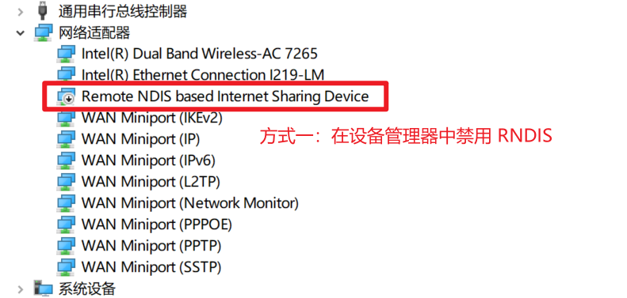

# Air724UG Development Tutorial

本教程记录了 Air724UG 二次开发中所需要的开发文档以及部分注意事项。  

## 前期准备

进行二次开发之前，需要准备相应的硬件和软件。  

### 硬件准备

此处列出本项目所用硬件以供参考。  

|序号|名称|数量|用途|
|:---:|---|:---:|---|
|01|银尔达 Air724UG 开发板带天线|1|运行脚本、执行预期任务的**主要本体**|
|02|Micro USB 数据线|1|为 Air724UG 开发板进行串口调试、**烧录固件**的操作|
|03|USB 转杜邦线|1|为 Air724UG 开发板**供电**|

---

**开发板供电接线方式：**  
USB 红线（*正极*）接开发板 `VIN` 针脚  
USB 黑线（*负极*）接开发板 `GND` 针脚  

---

**硬件全家福展示：**  

### 软件准备

此处列出 Air724UG 开发中所需的软件列表。  

|序号|软件|作用|官方地址|
|:---:|---|---|:---:|
|01|Windows USB 驱动|在 Windows 系统上正常识别 Air724UG 硬件|[Official Site](https://docs.openluat.com/usb_drv/)|
|02|LuaTools 工具|为 Air724UG 烧录固件、打印日志|[Official Site](https://docs.openluat.com/Luatools/)|
|03|VS Code|编写 Lua 脚本代码|[Official Site](https://code.visualstudio.com/)|

---

开发过程中偶尔会使用 AT 命令，此时还需要串口工具协助调试  
本项目中所用串口工具：[SuperCom - GitHub](https://github.com/SuperStudio/SuperCom)  

## 开发教程

Air724UG 资料汇总： [Air724UG全套资料包](https://doc.openluat.com/wiki/21?wiki_page_id=6313)  

### 环境搭建

本部分列出环境搭建步骤中较为重要的内容，其他步骤在官方文档中已经写的很清楚了，无需额外赘述。  

官方的环境搭建步骤：[环境搭建](https://doc.openluat.com/wiki/21?wiki_page_id=1923)  

#### 禁用 RNDIS 功能

RNDIS 协议可以让电脑使用 USB 设备的网络连接，例如手机与电脑 USB 连接后可以让电脑使用手机的网络上网。  

Air724UG 支持 RNDIS 协议，因此 Air724UG 插入 SIM 卡并连接电脑后，电脑可以使用 SIM 卡的网络上网。  

电脑会优先使用 RNDIS 协议上网，如果 SIM 卡流量不多，就容易超额，所以调试过程中需要关闭 RNDIS 功能。  

- Windows 端禁用 RNDIS 功能（**前提：Air724UG 插入 SIM 卡并连接电脑**）：  
    - **方式一**：设备管理器 -> 网络适配器  
        
    - **方式二**：控制面板 -> 网络和 Internet -> 网络和共享中心 -> 更改适配器设置  
        

- Air724UG 端关闭 RNDIS 功能（**前提：Air724UG 插入 SIM 卡并连接电脑**）：  
    - **方式一**：使用串口工具发送命令 `AT+RNDISCALL=0,1`  
    - **方式二**：在 Lua 脚本中加入代码 `ril.request("AT+RNDISCALL=0,1")`  

合宙 RNDIS 文档： [RNDIS](https://doc.openluat.com/wiki/21?wiki_page_id=2010)  

#### 烧录固件 & 脚本

Air724UG 的固件和脚本烧录步骤在官方文档中已经写的很清楚了，根据文档操作即可：[烧录底层固件及脚本](https://doc.openluat.com/wiki/21?wiki_page_id=1923#_74)  

首次打开 LuaTools 工具会提示更新，更新会下载最新固件，固件保存在 LuaTools 目录的 `resource` 文件夹中。  

  

---

此部分主要说明 Core 固件的选择，以下为 Core 固件名称和所支持功能列表的对应关系：  

  

本项目需要使用 TTS 语音播报，故需要选择支持 TTS 的固件。  

此外，本项目中所用 SIM 卡为电信卡，只能选择支持 VOLTE 的固件（**电信 2G/3G 退网，只能使用 VOLTE 通信**）。  

最终，本项目所使用的固件为： `Luat_RDA8910_TTS_NOLVGL_FLOAT.pac`  

### 开发文档

本部分列出开发过程中可能需要查阅的文档。  

|序号|文档|说明|
|:---:|---|---|
|01|[Lua语法介绍](https://doc.openluat.com/wiki/21?wiki_page_id=1925#Lua_4)|学习基本的 Lua 语法|
|02|[Lua语法学习（文字篇）](https://doc.openluat.com/wiki/26?wiki_page_id=3072)|学习基本的 Lua 语法|
|03|[LuatOS-Air core API](https://doc.openluat.com/wiki/21?wiki_page_id=2085)|底层 Core 固件自带的 API 接口|
|04|[LuatOS-Air script lib API](https://doc.openluat.com/wiki/21?wiki_page_id=2086)|LuatOS-Air Lib 提供的 API 接口|
|05|[如何使用http.request接口](https://doc.openluat.com/article/704)|`http.request()` 方法的详细使用|
|06|[Luat_lua_Air724 / script_LuaTask](https://gitee.com/openLuat/Luat_Lua_Air724U/tree/master/script_LuaTask)|Air724UG 的 Lib 源码和一些 Demo 文件|

合宙的官方文档给我的感觉是乱糟糟的，所以表中仅仅列举了本项目中用得较多的文档地址。  

## 参考项目

同款 Air724UG 芯片可参考的项目如下，可以参考这些项目的思路或者代码，编写属于自己的 Lua 脚本。  

- [使用Air724UG作为短信转发器 - Lotlab 博客](https://www.lotlab.org/2021/10/17/air724ug-sms-forwarder/)  
- [Air724UG 短信转发 & 来电通知 & 语音信箱 - GitHub](https://github.com/0wQ/air724ug-forwarder)  
- [Air724UG 短信转发 - GitHub](https://github.com/ourml/air724ug-sms-forwarder)  

